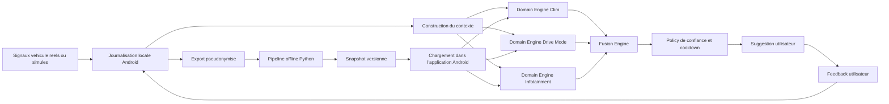
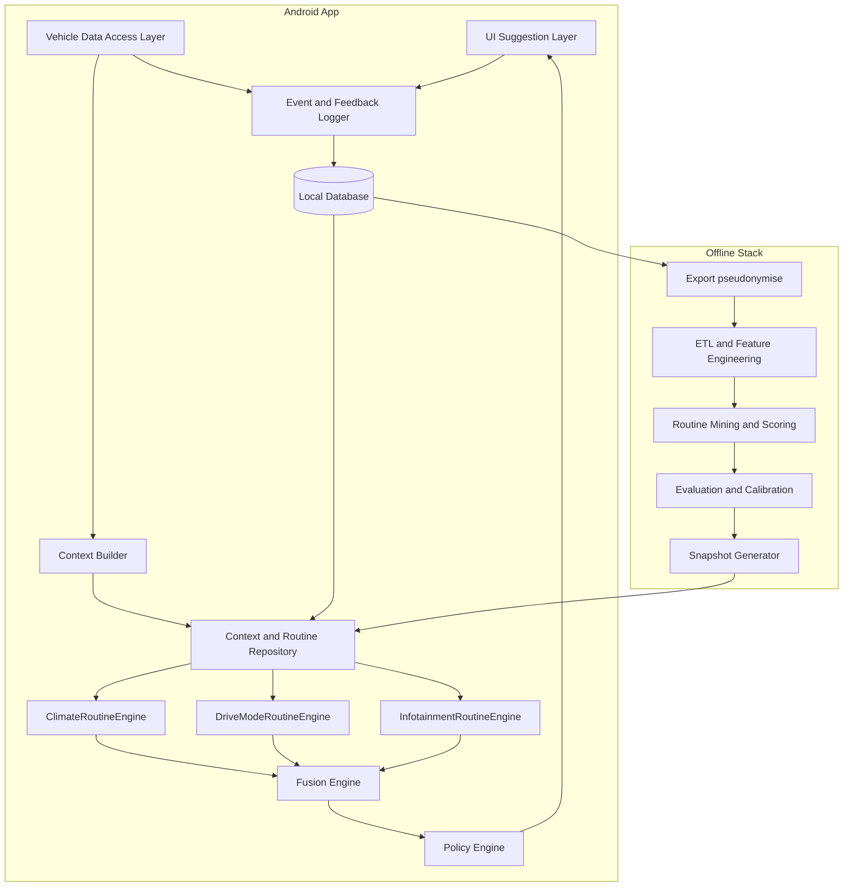
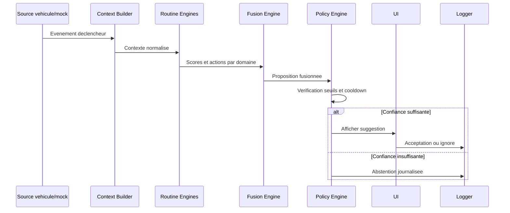
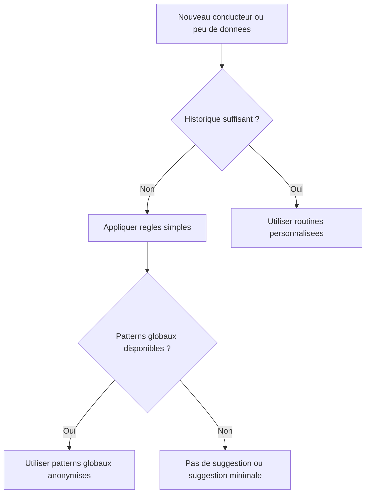

# Architecture technique - Detection des routines conducteur

## 1. Objet du document

Ce document decrit l'architecture cible du systeme de detection des routines conducteur pour un prototype Android embarquable. Il couvre :

- la vue d'ensemble du systeme
- les composants applicatifs et data
- les flux de donnees
- le cycle d'entrainement et de deploiement
- les choix d'architecture et leurs justifications

## 2. Principes d'architecture

Les principes directeurs retenus sont les suivants :

- inference on-device
- entrainement hors ligne
- modularite forte
- explicabilite des decisions
- privacy by design
- separation claire entre donnees brutes, features et recommandations
- compatibilite avec un environnement embarque reel ou simule

## 3. Vue d'ensemble

Le systeme est structure en deux parties principales :

- une plateforme offline de preparation et d'evaluation des routines
- une application Android de recommendation temps reel



## 4. Vue logique

### 4.1 Couches principales

1. `Vehicle Data Access Layer`
2. `Event Logging Layer`
3. `Local Storage Layer`
4. `Context Builder`
5. `Routine Engines`
6. `Fusion Engine`
7. `Policy Engine`
8. `Presentation Layer`
9. `Offline Training and Evaluation Pipeline`

### 4.2 Diagramme de composants



## 5. Description des composants

### 5.1 Vehicle Data Access Layer

Responsabilites :

- exposer une interface unifiee pour les signaux vehicule
- masquer la difference entre source reelle et source mockee
- fournir les evenements metier utiles au moteur

Entrees typiques :

- profil conducteur charge
- demarrage vehicule
- localisation ou zone detectee
- destination saisie dans le guidage
- reglages climatisation
- mode de conduite courant
- source infotainment

Implementations prevues :

- `MockVehicleDataSource`
- `ReplayVehicleDataSource`
- `RealVehicleDataSource` si disponible

### 5.2 Event and Feedback Logger

Responsabilites :

- journaliser les evenements source
- journaliser les suggestions emises
- journaliser les retours utilisateur
- journaliser les actions effectives observees apres suggestion

Ce composant constitue la base de tracabilite du systeme.

### 5.3 Local Storage Layer

Le stockage local repose sur une base embarquee de type Room/SQLite ou equivalent.

Tables logiques recommandees :

- `event_log`
- `feature_store`
- `routine_catalog`
- `feedback_log`
- `snapshot_metadata`

### 5.4 Context Builder

Responsabilites :

- convertir les signaux bruts en contexte semantique
- discretiser le temps
- associer une zone significative
- normaliser les destinations
- determiner la phase du trajet

Sortie type :

```text
driver=A
time_bucket=weekday_morning
origin_zone=home
destination_cluster=work
trip_phase=pre_departure
```

### 5.5 Routine Engines par domaine

Chaque moteur de domaine recoit un contexte normalise et retourne :

- une action candidate
- un score de confiance
- une explication simple

Moteurs prevus :

- `ClimateRoutineEngine`
- `DriveModeRoutineEngine`
- `InfotainmentRoutineEngine`

### 5.6 Fusion Engine

Responsabilites :

- combiner les sorties des moteurs de domaine
- autoriser des recommandations partielles
- eviter de forcer un pack complet artificiel

Le moteur de fusion ne retient qu'un sous-ensemble d'actions si certains domaines sont sous le seuil.

### 5.7 Policy Engine

Responsabilites :

- appliquer les seuils de confiance
- gerer le cooldown
- interdire les suggestions trop frequentes
- garantir qu'une seule suggestion soit visible a la fois
- decider l'abstention si la confiance est insuffisante

### 5.8 Presentation Layer

Responsabilites :

- afficher une suggestion concise et explicable
- proposer les actions `Appliquer` et `Ignorer`
- presenter la raison principale de la suggestion

Exemple d'explication :

"Le matin au depart du domicile vers le travail, vous choisissez souvent la clim a 21 degres et le mode Eco."

### 5.9 Offline Training and Evaluation Pipeline

Responsabilites :

- ingerer les logs exportes
- construire les features
- detecter les routines candidates
- calibrer les seuils
- mesurer les performances
- produire le snapshot embarque

## 6. Flux d'execution temps reel



## 7. Pipeline offline

### 7.1 Etapes du pipeline

1. ingestion des logs exportes
2. nettoyage et normalisation
3. construction des zones significatives et destinations semantiques
4. discretisation temporelle
5. mining de routines candidates
6. calcul des scores par domaine
7. calibration des seuils et evaluation
8. generation du snapshot versionne

### 7.2 Diagramme du pipeline


## 8. Modele de donnees logique

### 8.1 Source de verite

La source de verite locale est le `event_log`. Les autres structures sont derivees de celui-ci.

### 8.2 Tables recommandees

#### `event_log`

- `id`
- `timestamp`
- `driver_id`
- `event_type`
- `payload`
- `source_type`

#### `feature_store`

- `id`
- `timestamp`
- `driver_id`
- `time_bucket`
- `day_type`
- `origin_zone`
- `destination_cluster`
- `trip_phase`

#### `routine_catalog`

- `id`
- `snapshot_version`
- `driver_scope`
- `context_key`
- `domain`
- `action_payload`
- `score`
- `explanation_template`

#### `feedback_log`

- `id`
- `suggestion_id`
- `timestamp`
- `response_type`
- `observed_followup`

#### `snapshot_metadata`

- `version`
- `generated_at`
- `context_schema_version`
- `thresholds`

## 9. Snapshot embarque

### 9.1 Choix d'architecture

Le MVP embarque un snapshot declaratif versionne plutot qu'un modele opaque. Ce choix offre :

- meilleure explicabilite
- debogage plus simple
- portage Kotlin facilite
- evolution incrementalement controlable

### 9.2 Exemple de structure

```json
{
  "version": "2026.04.07",
  "context_schema": "v1",
  "thresholds": {
    "global": 0.72,
    "climate": 0.68,
    "drive_mode": 0.70,
    "infotainment": 0.80
  },
  "routines": [
    {
      "context": {
        "driver_profile": "A",
        "time_bucket": "weekday_morning",
        "origin_zone": "home",
        "destination_cluster": "work",
        "trip_phase": "pre_departure"
      },
      "actions": {
        "climate": {
          "temp": 21,
          "auto": true
        },
        "drive_mode": "eco"
      },
      "scores": {
        "climate": 0.88,
        "drive_mode": 0.81
      },
      "reason": "Routine frequente observee le matin pour ce trajet"
    }
  ]
}
```

## 10. Strategie algorithmique

### 10.1 Moteur MVP

Le moteur MVP est un moteur hybride explicable en deux etages.

Etage 1 : construction du contexte

- profil conducteur
- moment de la journee
- type de jour
- zone d'origine
- destination clusterisee
- phase du trajet

Etage 2 : scoring des routines

- frequence
- recence
- stabilite
- co-occurrence

### 10.2 Pourquoi pas du deep learning au MVP

- faible volume initial de donnees
- moindre explicabilite
- integration embarquee plus complexe
- benefice incertain sur les premiers cas d'usage

## 11. Gestion du cold start

La strategie retenue est une strategie a trois niveaux :

1. regles contextuelles simples
2. patterns globaux anonymises
3. personnalisation progressive par conducteur



## 12. Privacy et securite

Principes retenus :

- stockage local par defaut
- export pseudonymise uniquement
- pas de GPS brut dans le moteur metier
- retention maitrisee des logs
- journalisation des decisions et du feedback
- application uniquement apres confirmation utilisateur

## 13. Disponibilite et contraintes runtime

Objectifs techniques :

- fonctionnement hors ligne
- latence inferieure a 1 seconde sur evenement declencheur
- charge CPU et memoire maitrisee
- robustesse en absence de certains signaux

## 14. Deploiement et evolution

### 14.1 Cycle de vie du modele


### 14.2 Strategie de versionnement

- version du schema de contexte
- version du snapshot
- version de l'application Android
- compatibilite explicite entre snapshot et moteur d'inference

## 15. Strategie de test

### 15.1 Tests techniques

- tests unitaires du Context Builder
- tests unitaires des moteurs de domaine
- tests unitaires du moteur de fusion et de la policy
- tests d'integration du chargement de snapshot
- tests de rejeu d'evenements

### 15.2 Tests de performance

- mesure de latence de recommandation
- verification du comportement sans reseau
- tests avec signaux incomplets

### 15.3 Evaluation produit

- acceptance rate
- false positive rate
- coverage
- taux d'abstention

## 16. Roadmap technique

### Phase 1

- instrumentation et schema de donnees
- source mockee
- journalisation locale

### Phase 2

- pipeline Python
- generation de features
- premier moteur de routines

### Phase 3

- integration Kotlin
- chargement snapshot
- UI de recommandation

### Phase 4

- fusion multi-domaines
- calibration des seuils
- evaluation offline et demo live

### Phase 5

- documentation d'integration produit
- recommandations d'evolution v2

## 17. Conclusion

L'architecture proposee privilegie un socle produit realiste : inference embarquee, moteur explicable, modularite forte, respect de la vie privee et capacite d'evolution. Elle est suffisamment simple pour etre realisable dans un stage, tout en etant suffisamment structuree pour servir de base a une integration produit future.
